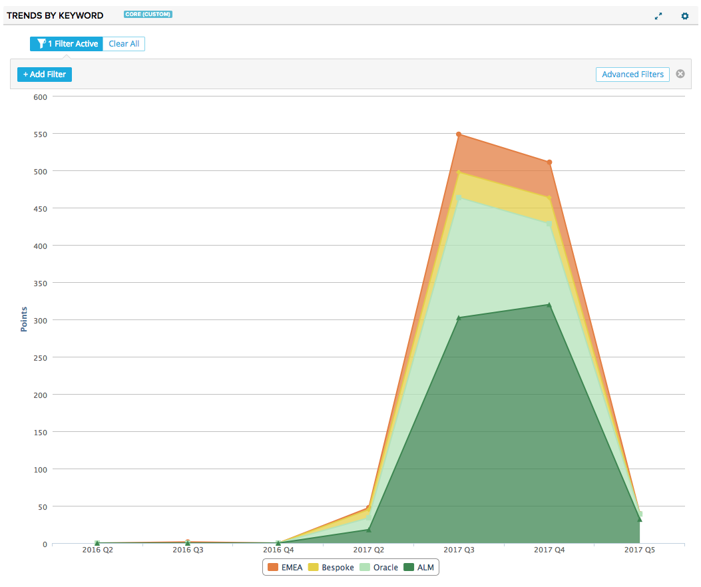
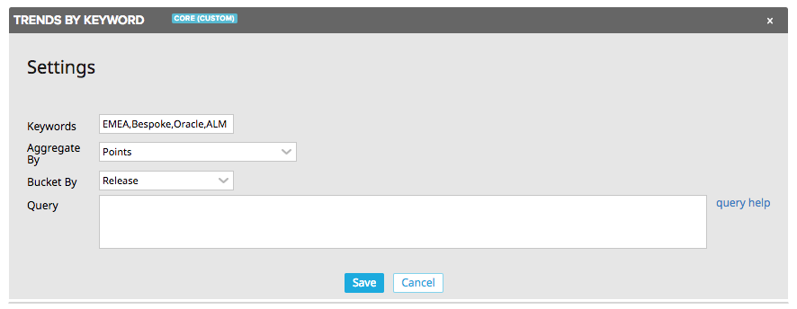

# Trends by Keyword

This app plots an area chart of stories and defects matching specified keywords.  The chart shows a trend over time, and the granularity of the x-axis is totally configurable (month, release, quarter, etc.)

## Installation and Settings
The app is installed as a Custom HTML App ([see help documentation](https://help.rallydev.com/custom-html))
Once the app is installed, use the gear menu on the app panel and select "Edit App Settings".

#### Aggregate By
Pick how to aggregate the data- by count or plan estimate total.

#### Bucket By
Pick the timeframe for which to generate values along the x-axis. Available options include month, quarter, release and year. Data will be bucketed based on accepted date (or release, if selected).

#### Query
In addition to the advanced filtering component in the app, you can write your own complex filter queries. [Extensive documentation](https://help.rallydev.com/grid-queries?basehost=https://rally1.rallydev.com) is available. This might be useful if you want to always limit the chart to certain complex criteria.
